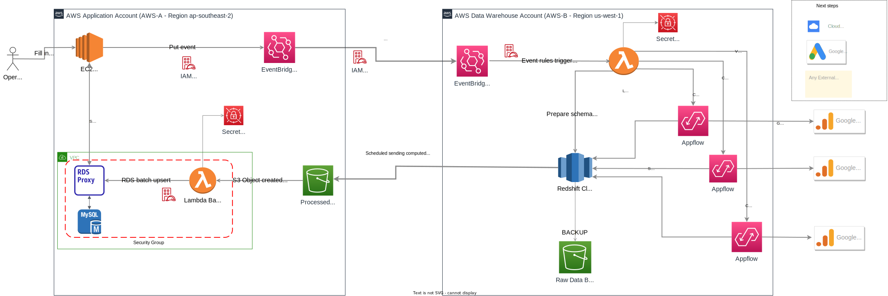

# AWS Appflow Google Analytics 4 Data Integration

## Architecure diagram



```diagram

AWS Account 1 (Application MyApp Account)
    |- EC2 Instance
        |- MyApp
            *Sends "RegisterDataFlow" event to EventBridge with input parameters in event detail
        |- EventBridge
            *Forward the "RegisterDataFlow" event to EventBridge of AWS Account 2 using a IAM Role that accepted by Account 2.
AWS Account 2 (Data Warehouse Account)
    |- EventBridge
        *Receives "RegisterDataFlow" event from Account 1
        *Triggers Lambda function to register data flows
    |- Lambda
        *Get required variables from Secret Manager
        *Creates Redshift schema/tables
        *Creates and schedules AppFlow data flows with approproate time range, data mapping, filter and validation.
    |- Appflow
        *The data flows use Secret Manager created connector to Google Analytics 4 and download raw data
        *The data flows use Secret Manager created connector to Redshift and send data to the schema/tables with option backup in an S3 bucket
    |- Redshift
        *Redshift will process and computed data via scheduler - store data in combined schema/tables.
        *Redshift will unload the calculated data to the cross account & region S3 bucket from AWS Account 1.
AWS Account 1 (Application Account)
    |- S3 Bucket
        *Receives data from Redshift unload scheduler processes.
        *Trigger serverless lambda invocation
    |- Lambda
        *Processes data in S3 bucket.
        *Upserts data to RDS MySQL instance via database proxy
    |- RDS MySQL Instance
        *Stores data
        *Serve data to MyApp
AWS Chatbot
    |- SNS Topic
        *Receives events from AppFlow data flows
    |- CloudWatch
        *Provides monitoring and logging for the various services in the workflow
    |- Slack Channels
        *Subscribed to SNS topic
        *Outout revelent information to slack channels
        *Retry/Renmediate data flows if failed or errors
AWS SAM Deployment
    |- Utilized for deployment and management of the Lambda functions and CloudFormation resources.
```

### Sequence Flows

1. A human operator will input params to Application MyApp in an EC2 instance in AWS Account 1 (application account).

2. The EC2 MyApp will initialise and send an event "RegisterDataFlow" to even bus of EventBridge followed a rule.

3. The event bus got discovered schema and will forward the "RegisterDataFlow" event to corss account, region event bus of AWS Account 2 (data warehouse account).

4. The event bus of account 2 will then trigger the Serverless Lambda invocation to register the data flows.

5. Lambda (with params in Secret Manager) creates Redshift tables using Assume Role associated with the Redshift cluster.

6. Lambda creates and schedules AppFlow data flows to pull data from Google Analytics 4 to Redshift tables, including data mapping, filtering, and validation. Data will be sent to AWS Redshift as source destination with using an s3 bucket as the backup option for failure or error cases.

7. Appflow data flows created use connections - Oauth2 credentials in Secret Manager to connect to Google Analytics 4

8. AWS Redshift will process and computed data - doing query joining and caculation, then schedule processes to send the calculated, combined, and joined data to a cross account, cross region S3 bucket - the AWS Account 1.

9. In Account 1, every event of Object created in S3 bucket will trigger a lambda function to batch process the data in S3 and upsert to RDS MySQL instance via a database proxy.

10. The data inserted to MySQL will be served for the MyApp to provide insights, reports and other multi tasks that needs computed data.

11. The whole process of the flow will be monitored and alerted via AWS Chatbot with specific Slack channels subscribe to the SNS topics filltered only for appflow related events.

12. The whole stacks are managed using AWS Serverless Application Model (SAM) - built and deploped via CI/CD thru Makefile tools integarted to pipelines.

### Additional details

The "RegisterDataFlow" event is sent to EventBridge in Account 1. The event contains the parameters that are needed to create the data flows.
The event bus in Account 2 forwards the "RegisterDataFlow" event to the Lambda function in Account 2.
The Lambda function uses the parameters in the event to create the data flows.

The data flows are created using the AppFlow connector for Google Analytics 4 as destination connection.
The AppFlow connector uses the OAuth2 credentials in Secret Manager to connect to Google Analytics 4.
The flows also use Redshift as source connection - with the usage of S3 bucket as backup option.
The data flows pull data from Google Analytics 4 and store it in Redshift tables in Account 2.

The Redshift tables are processed and computed data thru scheduler. The calculated, combined, and joined data is then sent to an S3 bucket in Account 1.

A Lambda function in Account 1 processes the data in the S3 bucket and upserts it to an RDS MySQL instance.
The RDS MySQL instance stores the data.

AWS Chatbot is used to monitor and alert the flow. The SNS topic is used to send events from AppFlow data flows to AWS Chatbot.
Slack channels are subscribed to the SNS topic. This allows users to receive alerts in Slack.
